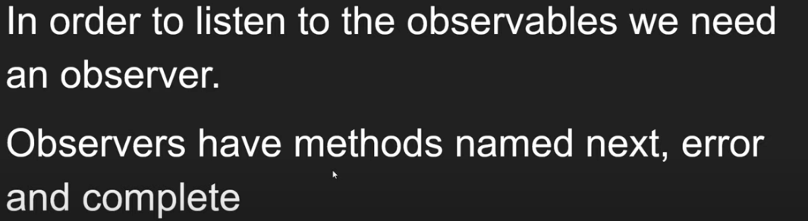

1. What is RxJS?
RxJS deals with single API ( called Observables ) to deal with data coming from multiple sources like data streams.

2. What are types of streams of data?
Synchronus Data
Asynchronus Data - callbacks adn promises
Getting Data from Server as HTTP calls 
DOM events - event handles
Functions with return value

3. Understand Observer Software pattern and how RxJS uses observer pattern with Observables - RxJS.

4. Integrating RxJS library with other popular Frameworks like Angular, Vue, and React - RxJS.

7. Observables vs Functions. Understand the similarities & differences between them - RxJS.

8. Cancelling the Subscribed Observable execution using the Subscription unsubscribe method - RxJS

9. Avoid Memory leakage when subscribing and unsubscribing Custom Observable by cleaning Code - RxJS

10. Understanding RxJS Operators. Two kinds of operators like Pipeable & Creation Operators in RxJS.

11. Implement multiple operators for observable using pipe method in RxJS
12. Choose right RxJS Operator from the list of categories of operators for an Observable - RxJS

13. RxJS Operators marble Diagram. Understand the functionality of operators by using Marble - RxJS

Buffer Buffer Count Buffer Time Buffer Toggle Buffer When Take TakeLast TakeUntil TakeWhile Skip SkipLast SkipUntil SkipWhile Distinct DistinctUntilChanged DistinctUntilKeyChanged Filter Sample Audit Throttle First Last Debounce ElementAt IgnoreElements Single Map MapTo Ajax

14. Higher Order Observables. What are Higher order mapping operators and why to use it - RxJS.

Merge Map showing concept of outer and inner observables:
 of(1, 2, 3) //outerobservable
      .pipe(
        mergeMap((value) => {
          return of(value * 10); //inner observable
        })
      )
      .subscribe((data) => {
        console.log(data);
      });
    of(1, 2, 3)
      .pipe(
        mergeMap((id) => {
          return ajax(`https://jsonplaceholder.typicode.com/posts/${id}`);
        })
      )
      .subscribe((data) => {
        console.log(data.response);
      });

15. MergeMap vs ConcatMap vs SwitchMap

16. What are RxJS Subjects. Benefits of using the Subject over observable in RxJS.

17.  Multicast and Unicast Observables. Why Subjects are multicast and Observables are Unicast - RxJS

18. Cold Observable vs Hot Observable. Learn differences between the cold & Hot Observables - RxJS.

6315499
19.  How to Convert Cold Observable to Hot Observable using Subject with example - RxJS
20. Behavior Subject | Difference between Subject and Behavior Subject - RxJS.

21. Types of Subject
22. RxJS CatchError Operator. Learn Error Handling CatchError Operator for observables Error - RxJS.
23. RxJS CombineLatest Operator. Learn Join Creation CombineLatest Operator - RxJS
24. RxJS Concat Operator. Learn RxJS Join Creation Operator Concat - RxJS
25. RxJS Merge Operator
26. RxJS Partition Operator
27. RxJS Race Operator. 
28. RxJS Schedulers. Learn Async, Asap, Queue Schedulers in the RxJS Observables.

30. Merge vs MergeAll vs MergeMap operators and its Differences - RxJS.
31. Concat vs ConcatAll vs ConcatMap operators and its differences in RxJS.
32. MergeMap vs ConcatMap vs SwitchMap vs ExhaustMap operators and its differences - RxJS
